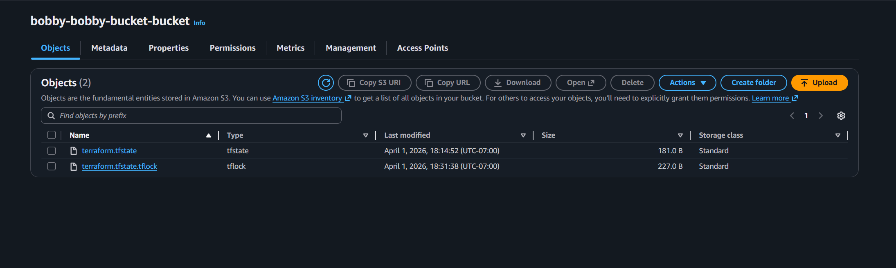

# terraform-s3-backend-lab

- Nuree Na
- Noppanat Sripan

**When is the state file created?**
- after `terraform apply` completes

**When is the lock file present?**
- it stays there while running `terraform apply` between entering the command and we typing in `yes`

**Is the lock file always in the bucket after it is created?**
- No it is automatically deleted after the apply finishes

**Take a screenshot of the AWS S3 web console that shows the state file only.**

**Take a screenshot of the AWS S3 web console that shows the lock file and the state file.**
